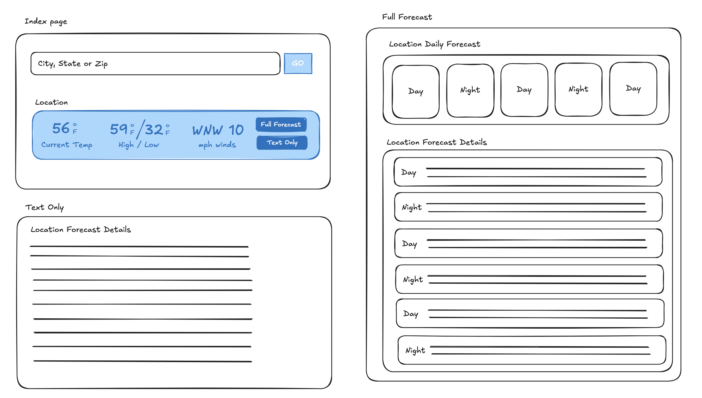

# My Weather Forecaster

Simple weather forecasting application. Using NOAA.gov public data and OpenWeatherMap free data.

##### Prerequisites

The setup steps expect following tools are installed on the system.

- Github
- Ruby [3.3.0](https://www.ruby-lang.org/en/news/2023/12/25/ruby-3-3-0-released/)
- Rails [8.0.2](https://rubyonrails.org/2025/3/12/Rails-Version-8-0-2-has-been-released)

##### 1. Check out the repository

```bash
git clone https://github.com/katman22/my_weather_forecaster.git
```
```bash
git clone git@github.com:katman22/my_weather_forecaster.git
```
```bash
gh repo clone katman22/my_weather_forecaster
```

##### 2. No Database needed

##### 3. Start the Rails server

You can start the rails server using the command given below.

```ruby
bundle exec rails s
```

And now you can visit the site with the URL http://localhost:3000/forecast/index

### First Version Layout Design



